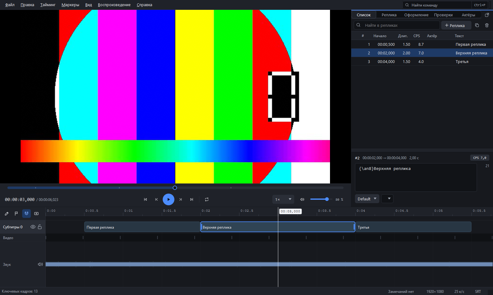

# SubtitleForge Studio

Редактор субтитров для Windows. Субтитры видно прямо на кадре, и двигать их
можно мышью — там же, где они окажутся у зрителя.



## Что умеет

Открывает и сохраняет ASS, SRT, WebVTT и TTML (он же DFXP — формат, в
котором субтитры принимают Netflix, Apple и Amazon). ASS читается и пишется байт в байт:
файл, прошедший через редактор без правок, останется прежним. При переходе в
SRT или VTT программа говорит, что потеряется — эти форматы беднее.

Показывает видео (libmpv) и рисует субтитры настоящей libass. То, что видно в
редакторе, совпадает с тем, что покажет плеер.

Окно устроено как в программах монтажа: кадр в середине, снизу таймлайн во всю
ширину, справа одна колонка со всем остальным. В колонке девять вкладок —
события, текст, реплика, формат, кадр, проверки, оформление, акторы,
замечания, — и любую можно вынести в отдельное окно кнопкой в её углу.
Закрытие этого окна возвращает вкладку на место. Ширина колонки тянется от
240 пикселей: у кого-то в ней идёт вся работа, у кого-то она справочная полоса
сбоку. Раскладка переключается в меню «Вид → Раскладка», список вкладок —
в «Вид → Колонка свойств».

Оформление настраивается при живом кадре: готовые наборы, шрифт, кегль,
начертание, цвета основного текста, обводки и тени, положение по девяти точкам
как на цифровой клавиатуре. Кадр рисует та же libass, что покажет плеер, а фон
под ним переключается на тёмный, светлый и градиент — на однотонном половину
ошибок оформления не видно. Внизу показана строка `Style:`, которая уйдёт в
файл. Готовое применяется к выделенным репликам или ко всему документу одним
шагом отмены.

Правка таймингов на таймлайне: волна звука, ключевые кадры, магниты к
склейкам и границам соседних реплик. Реплику можно тянуть за край или
целиком, создавать протяжкой, выделять рамкой сразу несколько.

Таблица реплик с подсчётом скорости чтения. Правка текста, стиля и говорящего
прямо в ячейке.

Действующие лица: у каждого свой цвет, и реплики этого человека им
закрашиваются — в длинном диалоге сразу видно, кто где говорит. Имя может
автоматически подставляться в текст реплики (шесть готовых форматов плюс
свой).

Проверки качества: 14 правил, 4 профиля (общий, два по требованиям Netflix,
свободный) плюс профили из файлов — требования заказчика описываются обычным
json и кладутся в папку профилей. Скорость чтения, длина строк, длительность,
зазоры, перекрытия, несуществующие стили, непарные скобки, типографика,
повторы, «висячие» короткие строки, близость к монтажной склейке.

Отчёт о проверке страницей или таблицей: сводка по важности, требования
профиля и список замечаний с временем и текстом реплики — то, что
прикладывают к сданной работе.

Автоматическая доводка таймингов: расширить реплики, сомкнуть мелкие зазоры,
дотянуть до минимальной длительности, подогнать под скорость чтения, притянуть
к склейкам, округлить к кадрам. Результат показывается до применения.

Работа с MKV: вшитые дорожки субтитров можно достать, поправить и записать
обратно.

Распознавание речи: семь моделей Whisper от 75 МБ до 2,9 ГБ, счёт на процессоре
или на видеокарте NVIDIA. Модели и библиотеки CUDA скачиваются из программы, в
каталог, который вы укажете.

Выравнивание готового текста по речи. Обычный заказ выглядит так: есть перевод
и есть видео, а таймингов нет. Программа прослушивает дорожку и раскладывает
уже написанный текст по речи — сам текст при этом не меняется. У каждой реплики
показывается, на скольких словах держится её время, и те, где опоры мало,
помечаются: их стоит проверить глазами. Тайминги применяются одним действием и
отменяются одним Ctrl+Z.

Текст без таймингов открывается отдельным пунктом: сценарий, расшифровка или
перевод из редактора. Делить на реплики можно по строкам или по абзацам, имя
перед двоеточием переносится в поле говорящего, номера страниц и ремарки в
скобках отбрасываются. Что получится, видно до импорта.

Глоссарий: как переводить термины и имена. Если оригинал подключён, а в
переводе термина нет — реплика попадает в панель проверок. Обмен через CSV,
в том виде, в каком глоссарии присылают заказчики.

Двуязычный режим для перевода: оригинал подключается вторым файлом и
показывается колонкой рядом с переводом и полем над ним. Сопоставление по
времени, а не по номерам реплик. Оригинал живёт в проекте, правке не подлежит
и в готовый файл не попадает.

Проверка орфографии в поле правки: незнакомые слова подчёркиваются, замены и
«добавить в словарь» — по правому щелчку. Словари Hunspell, русский и
английский в комплекте. Свой словарь общий для всех проектов: имена
персонажей повторяются из серии в серию.

Маркеры на таймлайне — как в монтажных программах. Флажок у линейки ставит
отметку на текущем времени: имя, примечание, ключевое слово и один из
шестнадцати цветов. Маркер можно тянуть мышью, растянуть на отрезок и найти
в общем списке поиском по имени, примечанию или ключевому слову. Отметки
привязаны ко времени, а не к репликам, и хранятся в самом файле ASS.

Рабочие пометки: черновик, готово, вопрос — и заметка к реплике. В строке
состояния счётчик готовности, Shift+F9 ведёт по вопросам. Пометки хранятся
в самом файле ASS и не мешают другим программам его читать.

Поиск и замена по всему файлу, шаблоны оформления с живым превью, отмена и
возврат любого действия, автосохранение, настраиваемые горячие клавиши.

Оформление: четыре встроенные темы (тёмная, светлая, тёплая, контрастная),
свой акцентный цвет и темы из файлов — обычный json с цветами, который
кладут в папку тем. Плавные появления окон и прокрутки можно выключить или
оставить как в системе. Подробности — в [docs/THEMES.md](docs/THEMES.md).

Плагины: свой код на Python может добавлять пункты меню, правила проверок и
форматы файлов. Четыре готовых примера лежат в `examples/plugins`.

Два языка интерфейса: русский и английский. Переключаются в настройках,
применяются после перезапуска. Английский переведён целиком — включая меню,
окна, подсказки, сообщения об ошибках и вывод командной строки. Перевод лежит
обычным json в `src/sfstudio/locale`, так что свой язык добавляется файлом.

Чего пока нет: распознавания текста с картиночных дорожек (PGS, VobSub),
счёта на видеокартах AMD и Intel, языков помимо русского и английского.

## Как поставить

Готовый `SubtitleForgeStudio.exe` лежит в
[релизах](../../releases/latest) — один файл, ставить ничего не нужно.

Из исходников:

```bash
pip install -e ".[dev,gui,media]"
```

Нужен Python 3.14. Проверено с PySide6 6.11, PyAV 18.1, NumPy 2.5.

Для видео и точного рисования субтитров нужны libmpv и libass. Проверить,
на месте ли они:

```bash
python build/vendor_libs.py --check
```

Разложить из скачанного архива:

```bash
python build/vendor_libs.py --from-archive путь/к/mpv-dev-x86_64.7z
```

Ссылки на архивы — в начале файла `build/vendor_libs.py`. Без этих библиотек
редактор работает, но видео не покажет.

## Как запустить

```bash
python -m sfstudio
```

```bash
python -m sfstudio фильм.mkv
```

Версии всех компонентов — `python -m sfstudio --version`, быстрая самопроверка
ядра — `python -m sfstudio --selftest`, список плагинов — `--plugins`.

Пакетная обработка без графики — сериал это двенадцать файлов, и одно
действие над ними руками делается двенадцать раз:

```bash
python -m sfstudio --batch *.srt --shift 500 --to ass --out готово
```

Ещё `--check` прогоняет проверки и кладёт отчёт рядом. Исходники не
перезаписываются, пока не сказано `--overwrite`; неудача одного файла не
останавливает остальные, а код возврата отличен от нуля, если что-то не
вышло.

## Горячие клавиши

Кадр:

| Действие | Как |
|---|---|
| Выбрать или тянуть субтитр | Левая кнопка мыши |
| Только по горизонтали или вертикали | Shift при перетаскивании |
| Без магнитов | Alt при перетаскивании |
| Отменить начатое перетаскивание | Esc |
| Сдвинуть на 1 или 10 точек | Стрелки, Shift+стрелки |
| Убрать ручное положение | Ctrl+Shift+P |
| Направляющие, безопасные зоны | F6, F7 |

Видео:

| Действие | Как |
|---|---|
| Играть и пауза | Space |
| Кадр вперёд, назад | →, ← |
| Крутить текущую реплику по кругу | Ctrl+Space |

Таймлайн:

| Действие | Как |
|---|---|
| Перемотать | Щелчок по волне |
| Изменить начало или конец | Тянуть за край реплики |
| Сдвинуть целиком | Тянуть за середину |
| Новая реплика | Ctrl и протянуть по пустому месту |
| Поставить маркер | Щелчок по полосе маркеров под линейкой |
| Правка маркера, перенос | Щелчок по флажку, перетаскивание |
| Приблизить, прокрутить, усилить волну | Ctrl+колесо, колесо, Shift+колесо |
| Уместить всё, уместить выделенное | Home, F |
| Магниты | F8 |

Правка:

| Действие | Как |
|---|---|
| Вставить реплику из буфера обмена | Ctrl+Shift+V |
| Поиск и замена | Ctrl+F |
| Панель проверок, следующая находка | F4, F9 |
| Следующая реплика с вопросом | Shift+F9 |
| Доводка таймингов, сдвиг | Ctrl+T, Ctrl+Shift+T |
| Поставить маркер | Alt+M |
| Предыдущий, следующий маркер | Alt+←, Alt+→ |
| Список маркеров | Alt+Shift+M |
| Шаблоны оформления | Ctrl+Shift+Y |
| Записать субтитры в контейнер | Ctrl+E |

Правая кнопка мыши на реплике — создать, вставить из буфера, дублировать,
удалить, назначить говорящего. То же меню в таблице реплик.

Клавиши меняются в настройках.

## Разработка

```bash
python tools/run_tests.py
```

1693 теста, около двадцати секунд. Два захода: основная часть в четыре
процесса, медийная — последовательно.

Так пришлось разделить по двум причинам. В одном процессе полторы тысячи
тестов с Qt, libmpv и libass копят состояние, и сессия стала обрываться
падением интерпретатора в конце — при том, что все тесты проходили.
Параллельный прогон это вылечил, но тесты, создающие экземпляры libmpv, при
нескольких одновременных копиях дают то падение рабочего процесса, то
зависание. Отсюда два захода.

`pytest` тоже работает — он выполнит основную часть; медийная помечена
`serial` и берётся командой `pytest -m serial -n 0`.

Графические тесты идут без экрана, для медиа генерируется настоящий MKV с
заранее известным содержимым — внешние файлы не нужны. Тесты, которым нужны
libmpv или libass, пропускаются, если библиотек нет.

```bash
python -m ruff check src tests build
```

Сборка одного exe и раскладка комплекта для проверки:

```bash
python build/release.py
```

## Лицензия

GNU GPL версии 3 или новее — полный текст в файле [LICENSE](LICENSE).
Коротко: пользоваться и переделывать можно свободно, но если вы
распространяете изменённую версию, исходники тоже должны быть открыты.

Программа использует libmpv и libass — у них свои лицензии, смотрите условия
в самих проектах. Сборки этих библиотек в репозиторий не входят: их
раскладывает `build/vendor_libs.py`.

## Документация

* [docs/IDEAS.md](docs/IDEAS.md) — что добавить для профессиональной работы
* [docs/THEMES.md](docs/THEMES.md) — темы оформления, акцент, анимации
* [docs/ROADMAP.md](docs/ROADMAP.md) — что сделано, чего это стоило, что осталось
* [docs/SECURITY.md](docs/SECURITY.md) — аудит безопасности
* [docs/MODULES.md](docs/MODULES.md) — из чего состоит программа
* [docs/BUILD.md](docs/BUILD.md) — сборка подробно
* [docs/AUDIT_v1.1.md](docs/AUDIT_v1.1.md) — разбор правок спецификации
