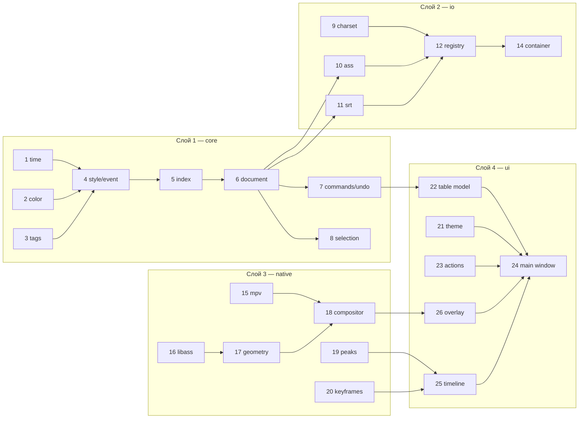

# Разбиение на модули и порядок сборки

Проект разбит на **19 модулей** в 5 слоях. Каждый модуль — единица работы с чётким
контрактом, собственными тестами и критерием готовности. Порядок нумерации = порядок
реализации: модуль N зависит только от модулей с меньшими номерами.

Легенда статуса: ✅ готово в прототипе · ⬜ не начато

---

## Слой 0 — Фундамент (без внешних зависимостей)

| # | Модуль | Файлы | Зависит от | Статус |
|---|--------|-------|------------|:------:|
| 0 | **Скелет проекта** | `pyproject.toml`, `__init__.py`, `__main__.py` | — | ✅ |

**Контракт:** пакет импортируется, `python -m sfstudio --version` печатает версию без
создания `QApplication`. Конфигурация ruff/pytest/mypy на месте.

---

## Слой 1 — `core` (чистый Python, ноль зависимостей, 100% тестируемо)

Это ядро. Оно не знает ни про Qt, ни про видео, ни про файлы. Именно поэтому
оно тестируется быстро и полностью, и именно поэтому его надо сделать первым.

| # | Модуль | Файлы | Зависит от | Статус |
|---|--------|-------|------------|:------:|
| 1 | **Время и кадры** | `core/time.py` | — | ✅ |
| 2 | **Цвет** | `core/color.py` | — | ✅ |
| 3 | **Теги ASS** | `core/tags.py` | — | ✅ |
| 4 | **Сущности** | `core/style.py`, `core/event.py` | 1, 2, 3 | ✅ |
| 5 | **Временной индекс** | `core/index.py` | 4 | ✅ |
| 6 | **Документ** | `core/document.py`, `core/changeset.py` | 4, 5 | ✅ |
| 7 | **Команды и отмена** | `core/undo.py`, `core/commands/*` | 6 | ✅ |
| 8 | **Выделение** | `core/selection.py` | 6 | ✅ |

### Контракты

**1. Время.** `FpsModel` на `Fraction` (не float): `frame_of`, `frame_start_ms`, `snap`.
`Timecode`: format/parse для ASS (сантисекунды), SRT, VTT, SMPTE.
*Критерий:* `parse(format(ms)) == ms` для всех форматов на диапазоне 0–24 ч (hypothesis).

**2. Цвет.** `RGBA` с конверсией в/из ASS `&HAABBGGRR`. Внутри `a=255` — непрозрачный,
в ASS наоборот; инверсия инкапсулирована здесь и больше нигде.
*Критерий:* `from_ass(to_ass(c)) == c` для всех 2³² значений (выборочно).

**3. Теги.** Парсер `{\pos(1,2)\an5}` → структура; писатель, умеющий **точечно** заменить
один тег, не тронув остальные и сохранив неизвестные дословно. Плюс `plain_text` с картой
смещений (для поиска/замены по тексту без тегов).
*Критерий:* идемпотентность `set_event_tag`; `set → remove` возвращает исходную строку;
никакой ввод не вызывает исключение.

**5. Индекс.** `active_at(t)` за O(log n + k), `range(t0,t1)`.
*Критерий:* совпадение с наивной O(n) реализацией на случайных наборах интервалов
(**здесь ловится баг из аудита B1**).

**6. Документ.** `SubtitleDocument` + `ScriptInfo`; стабильные `eid`; `_revision`;
`ChangeSet` как дельта для точечного обновления UI.
*Критерий:* любое изменение поднимает `_revision` и отдаёт корректный `ChangeSet`.

**7. Команды.** `Command.apply/revert` → `ChangeSet`; `UndoStack` с coalescing и
транзакциями; хранение **дельт**, не снимков.
*Критерий:* для любой последовательности команд `apply×N → revert×N` возвращает документ
в исходное состояние побайтово (round-trip через сериализацию).

---

## Слой 2 — `io` (файлы и контейнеры)

| # | Модуль | Файлы | Зависит от | Статус |
|---|--------|-------|------------|:------:|
| 9 | **Кодировки** | `io/charset.py` | — | ✅ |
| 10 | **Формат ASS** | `io/formats/ass.py` | 1–6 | ✅ |
| 11 | **Формат SRT** | `io/formats/srt.py` | 1–6, 3 | ✅ |
| 12 | **Реестр форматов** | `io/registry.py` | 10, 11 | ✅ |
| 12а | **Оверлей-прототип** | `ui/preview.py` | 17, 21 | ✅ |
| 13 | **Формат WebVTT** | `io/formats/vtt.py` | 12 | ✅ |
| 14 | **Контейнеры** | `io/container.py`, `platform/ffmpeg.py`, `ui/dialogs.py` | 12, PyAV, ffmpeg | ✅ |
| 14а | **Метаданные медиа** | `media/probe.py` | PyAV | ✅ |

### Контракты

**10. ASS.** Собственный парсер, не `pysubs2`.
*Обоснование отхода от спецификации v1.0:* `pysubs2` нормализует документ при чтении —
теряет порядок секций, комментарии и незнакомые ключи заголовка. Для заявленной в §7.5
гарантии побайтового round-trip этого достаточно, чтобы дисквалифицировать его как базу.
`pysubs2` остаётся в зависимостях как **резервный ридер** для экзотики (MicroDVD, TMP).
*Критерий:* `read → write` даёт побайтово идентичный файл на всём golden-корпусе.

**11. SRT.** Чтение с восстановлением после битых блоков; запись с деградацией
ASS→SRT и отчётом о потерях.
*Критерий:* отчёт о потерях перечисляет все отброшенные теги.

**14. Контейнеры.** `list_tracks` (дорожки, язык, disposition), `extract_subtitles`
(сборка ASS из `extradata` + пакетов), `mux_subtitles` через ffmpeg с атомарной записью.
*Критерий:* MKV → правка → ремукс → видео и звук на месте. ✅

Что выяснилось на реальном файле и определило устройство модуля:

* **Заголовок ASS живёт в `extradata`**, а не в пакетах — один раз на дорожку.
* **Закомментированные строки ffmpeg тоже кладёт в `extradata`**: у `Comment:`
  нет пакета, показывать нечего. Разбирать extradata как «просто заголовок»
  означает молча потерять все комментарии переводчика.
* **Пакеты идут в транспортном порядке полей**
  `ReadOrder,Layer,Style,Name,MarginL,MarginR,MarginV,Effect,Text` — без
  времени, хотя строка `Format:` в заголовке описывает файловый порядок
  со `Start`/`End`. Разбор «по Format из заголовка» сдвигает все поля.
* **`-map -0:s:N` ждёт номер среди субтитровых дорожек**, а не глобальный
  индекс потока. Спутать их — удалить не ту дорожку.

---

## Слой 3 — `media` и `render` (нативные библиотеки)

Самый рискованный слой. Требует внешних бинарей — **сюда нельзя заходить, не выполнив
вендоринг** (`build/vendor_libs.py`).

| # | Модуль | Файлы | Зависит от | Статус |
|---|--------|-------|------------|:------:|
| 15 | **Плеер mpv** | `media/player.py` | libmpv, PySide6 | ✅ |
| 16 | **Рендер libass** | `render/libass.py`, `render/renderer.py` | libass | ✅ |
| 17 | **Геометрия** | `render/geometry.py` | 16 | ✅ |
| 18 | **Видеовиджет** | `ui/video_widget.py`, `ui/video_pane.py` | 15, 16 | ✅ |
| 19 | **Пики аудио** | `media/peaks.py` | PyAV, numpy | ✅ |
| 20 | **Индекс кадров** | `media/keyframes.py` | PyAV | ✅ |

**Критерий готовности слоя (он же — цель спайка):** окно, в котором играет видео,
поверх него libass рисует субтитр, субтитр перетаскивается мышью, `\pos` пишется
в документ через команду, `Ctrl+Z` возвращает назад. Задержка ≤ 16 мс.

---

## Слой 4 — `ui` и `services`

| # | Модуль | Файлы | Зависит от | Статус |
|---|--------|-------|------------|:------:|
| 21 | **Тема и токены** | `ui/theme.py` | PySide6 | ✅ |
| 22 | **Модель таблицы** | `ui/event_table.py` | 6, 7 | ✅ |
| 23 | **Реестр действий** | `ui/actions.py`, `ui/palette_dialog.py` | — | ✅ |
| 24 | **Главное окно** | `ui/main_window.py`, `ui/preview.py` | 21–23 | ✅ |
| 25 | **Таймлайн** | `ui/timeline.py`, `ui/tasks.py` | 19, 20 | ✅ |
| 26 | **Оверлей** | `ui/overlay.py` | 17, 18 | ✅ |
| 27 | **QC** | `services/qc.py`, `ui/qc_panel.py` | 6 | ✅ |
| 28 | **Автотайминг/сдвиг** | `services/autotiming.py`, `ui/timing_dialog.py` | 7, 20 | ✅ |
| 29 | **Настройки и пути** | `platform/paths.py`, `app/settings.py` | — | ✅ |
| 30 | **Кастомизация интерфейса** | `ui/layout.py` | 24, 29 | ✅ |
| 31 | **Шаблоны стилей** | `services/style_presets.py`, `ui/style_dialog.py`, `core/commands/style_cmds.py` | 6, 16, 29 | ✅ |
| 32 | **Дорожки** | `core/tracks.py`, `core/commands/track_cmds.py` | 6 | ✅ |
| 33 | **Акторы** | `core/actors.py`, `core/commands/actor_cmds.py`, `ui/actors_dialog.py` | 6 | ✅ |
| 34 | **Действующее оформление** | `core/effective.py` | 6, 8 | ✅ |
| 35 | **Транспорт** | `ui/transport.py` | 15, 24 | ✅ |
| 36 | **Быстрое оформление** | `ui/quick_format.py` | 26, 34 | ✅ |
| 37 | **Инспектор** | `ui/inspector.py` | 32–34 | ✅ |
| 38 | **Проект** | `core/project.py`, `io/project_file.py` | 6, 16 | ✅ |
| 39 | **Стартовое окно** | `ui/startup_dialog.py`, `ui/new_project_dialog.py` | 38, 29 | ✅ |
| 40 | **Настройки программы** | `ui/preferences_dialog.py`, `ui/combo.py` | 29, 30 | ✅ |
| 41 | **Контракт распознавания** | `services/asr/base.py`, `services/asr/registry.py` | — | ✅ |
| 42 | **Подготовка звука и нарезка** | `services/asr/audio.py`, `services/asr/segmentation.py` | 41, 19 | ✅ |
| 43 | **Адаптеры движков** | `services/asr/engines/*` | 41, 42 | ✅ |
| 44 | **Окно распознавания** | `ui/asr_dialog.py`, `ui/asr_task.py` | 41–43, 24 | ✅ |

---

## Граф зависимостей



**Жёсткое правило слоёв:** `core` не импортирует `io`, `media`, `render`, `ui`, PySide6.
Проверяется тестом `tests/unit/test_layering.py`, который парсит AST всех модулей.

---

## Порядок работ (что после чего)

1. **Модули 0–8 (`core`)** — полностью, с тестами. Никаких внешних зависимостей,
   поэтому делается быстро и без риска. ✅ *сделано в прототипе*
2. **Модули 9–12 (`io` текстовые форматы)** — открытие/сохранение реальных файлов.
   ✅ *сделано в прототипе*
3. **Модули 21–24 (минимальный UI)** — таблица + редактор текста + открыть/сохранить.
   На этом этапе получается **работающий редактор субтитров без видео** — уже полезный
   продукт, который можно давать на обкатку. ✅ *сделано в прототипе*
4. **Модули 19–20, 25** — таймлайн с волной. ✅ *сделано в прототипе*

   Порядок относительно спайка пришлось поменять. Изначально спайк libmpv шёл раньше,
   но он упирается в нативные библиотеки, которых нет на машине разработки, тогда как
   PyAV несёт ffmpeg внутри колеса — значит пики, ключевые кадры и весь таймлайн
   делаются и **проверяются на настоящем медиафайле** без единой внешней DLL.
   Писать спайк вслепую, не имея возможности его запустить, было бы хуже: получился
   бы непроверенный код, а порядок работ всё равно определяется тем, что можно
   довести до рабочего состояния прямо сейчас.

5. **Спайк модулей 15–18** — mpv + libass + drag поверх живого видео.
   ✅ *сделано; главный технический риск проекта закрыт.*

   Что выяснилось на практике и не следовало из документации:

   * **Оверлей нельзя класть отдельным виджетом поверх ``QOpenGLWidget``.**
     Перекрытый GL-виджет в Qt 6 перестаёт отдавать кадр, и видео чернеет.
     Единственный рабочий путь — рисовать ``QPainter``-ом внутри ``paintGL``.
     Из-за этого логика оверлея вынесена в ``OverlayController``, общий для
     режима с видео и без.
   * **Чужие GL-вызовы обязаны быть в ``beginNativePainting()``.** Без этого
     обрамления смешение рендера mpv и ``QPainter`` роняет процесс внутри
     драйвера без сообщения.
   * **Файл нельзя отдавать плееру раньше, чем создан GL-контекст.** mpv
     выбирает декодер при инициализации файла; без контекста он остаётся без
     аппаратного декодирования и не переинициализируется. Загрузка отложена
     на следующий тик цикла событий.
   * **Порядок завершения:** сначала освободить render-контекст (при активном
     GL-контексте), только потом завершать плеер.

6. **Модуль 14 (контейнеры)** — извлечение вшитых дорожек и ремукс. ✅ *сделано*
7. **Модуль 27 (QC)** — проверки качества с профилями. ✅ *сделано*

   Инкрементальность оказалась не оптимизацией, а необходимостью: первая
   версия пересортировывала документ на каждую правку и тратила 2.8 мс при
   бюджете 0.5 мс. После перевода поиска соседей на ``TimeIndex`` (словарь
   позиций, O(1)) — 0.024 мс, в 115 раз быстрее.

8. **Модуль 29 (настройки)** — хранилище пользовательских настроек. ✅ *сделано*

   Общий фундамент для двух следующих модулей: ни раскладку окна, ни шаблоны
   стилей негде хранить, пока нет версионированного конфига с миграциями.

9. **Модуль 30 (кастомизация интерфейса)** — панели вместо жёсткой сетки. ✅ *сделано*

   Сейчас окно собрано из ``QSplitter``: границы тянутся мышью, но панели
   нельзя ни оторвать, ни переставить, ни спрятать по отдельности, и раскладка
   не переживает перезапуск. Перевод на ``QDockWidget`` даёт всё это разом,
   плюс пресеты раскладок под разные задачи: «Тайминг» (широкий таймлайн),
   «Перевод» (крупная таблица и редактор), «Оформление» (большой кадр).

   *Контракт:* панель можно оторвать, переставить, скрыть и растянуть мышью;
   раскладка сохраняется и восстанавливается при следующем запуске; пункт
   «Сбросить раскладку» возвращает исходную. ✅

   Кадр остался **центральным виджетом**, а не панелью: его не закрывают и не
   отрывают, вокруг него всё и построено. Панелям обязательно задавать
   ``objectName`` — без него ``saveState`` молча не сохраняет их положение.

10. **Модуль 31 (шаблоны стилей)** — быстрое применение оформления. ✅ *сделано*

    Пользовательский набор готовых стилей (шрифт, размер, цвета, обводка,
    тень, выравнивание, поля), который живёт **между документами**, а не
    внутри одного файла. Применение к выделенным событиям в один клик,
    живое превью на текущем кадре через libass — не на абстрактной картинке,
    а на настоящем видео, где стиль и будет работать.

    *Контракт:* шаблон сохраняется, переживает перезапуск, применяется к
    выделению одной командой (с отменой), превью совпадает с результатом. ✅

    Хранение — по файлу на шаблон: их можно переносить и присылать поштучно,
    а повреждение одного не уносит библиотеку. Встроенные шаблоны нельзя
    удалить (они вернутся при перезапуске, и удаление выглядело бы сломанным)
    — вместо этого свой шаблон с тем же именем перекрывает встроенный.

11. **Модуль 28 (автотайминг)** — доводка и сдвиг таймингов. ✅ *сделано*

    Модуль считает **план**, а не правит документ: диалог показывает
    предпросмотр «было → стало» до применения, а вся доводка ложится в один
    шаг отмены. Массовую правку таймингов трудно оценить на глаз — «сдвинуть
    на 400 мс» звучит безобидно, пока не выяснится, что половина реплик
    уехала за начало файла.

    Два правила выяснились на предпросмотре, а не в проектировании:

    * **Порядок шагов фиксирован.** Сначала расширение (lead-in/out, минимум,
      скорость чтения), потом смыкание зазоров, потом привязка к склейкам и
      сетке кадров, и только затем разрешение конфликтов. Переставить —
      значит получить перекрытия там, где их только что убрали.
    * **Доводка не укорачивает то, что было.** Соседи расширяются навстречу,
      и без защиты расширение одной реплики отъедало конец у предыдущей:
      пользователь просил «длиннее», а часть реплик становилась короче.
    * **Привязка к склейке фиксирует границу**: следующий шаг округления к
      сетке её не трогает, иначе точное попадание на монтажный стык сбивалось.

12. **Модуль 13 (WebVTT)** — чтение и запись. ✅ *сделано*

    Формат отличается от SRT не только точкой вместо запятой: обязательный
    заголовок, необязательный идентификатор реплики, блоки ``NOTE``/``STYLE``/
    ``REGION``, разметка тегами и HTML-мнемоники, и главное — **своя система
    позиционирования** в процентах от кадра (``align``, ``line``, ``position``).

    Соответствие с ASS неточное в обе стороны, и это неизбежно: WebVTT задаёт
    положение в процентах относительно строки текста, ASS — якорем и пикселями
    ``PlayRes``. Правило выбрано такое: выравнивание переносится всегда, а
    ``\pos`` ставится только когда положение задано явно. Значения по
    умолчанию означают «плеер решает сам», и превращать их в жёсткие
    координаты значило бы прибить гвоздями то, что автор намеренно оставил
    на усмотрение плеера.

**План выполнен полностью.** Все 31 модуль закрыты.
6. **Модуль 26** — полноценный оверлей со всеми инструментами.
7. **Модули 14, 27, 28** — контейнеры, QC, автотайминг.

Пункты 4 и 5 независимы и параллелятся при работе вдвоём.

---

## Почему именно такой порядок

Порядок выбран по принципу **«риск и фундамент вперёд, украшения назад»**:

- Слой 1 — фундамент, от него зависит всё; ошибка здесь дорога, а тестируется он
  дёшево (нет ни GUI, ни файлов, ни нативных библиотек). Делать первым.
- Пункт 3 даёт **работающий продукт на четверти пути** — редактор субтитров без видео
  закрывает сценарий S2 из спецификации. Это страховка: даже если спайк из пункта 4
  провалится, продукт уже существует.
- Пункт 4 — единственный настоящий технический риск проекта. Он идёт сразу после
  того, как появляется что-то, во что можно встроить результат, и до того, как будет
  написан код, зависящий от его архитектуры.


---

## Дорожки и акторы: где они живут в файле

Оба реестра пишутся в ``[Script Info]`` одним ключом JSON каждый —
``SFStudio Tracks`` и ``SFStudio Actors``. Решение и его причины:

**Дорожка субтитров — это ``layer`` события ASS, а не наша надстройка.** У каждой
реплики в ASS есть целочисленный ``Layer``: при наложении та, у которой номер
больше, рисуется поверх. Это ровно семантика дорожки в монтажном столе, и она уже
сохраняется в файле любым плеером и редактором. Отдельная сущность «сбоку» дала бы
два независимых понятия порядка — наше и настоящее, — и они разъезжались бы при
каждом открытии файла в другой программе.

**Имя актора — это поле ``Name`` реплики.** Оно было в модели с самого начала; не
хватало только реестра с цветами. Отдельного идентификатора у актора нет намеренно:
иначе переименование пришлось бы разносить по всем событиям, а при открытии чужого
файла — сопоставлять неизвестно что с неизвестно чем.

Чего в ASS хранить негде — имя дорожки, цвет, замок, цвет актора — уходит в
``[Script Info]``. Незнакомые ключи этой секции наш парсер, Aegisub и libass
сохраняют дословно и игнорируют, поэтому файл остаётся обычным ASS. JSON выбран
ради экранирования: имя актора может содержать запятые и двоеточия, на которых
самодельный разделитель сломался бы.

Обычный файл нашими полями не обрастает: единственная безымянная дорожка со слоем 0
и пустой реестр акторов не записываются вовсе — при следующем открытии они
восстановятся из самих реплик.


---

## Формат проекта (`.sfproj`)

ZIP-контейнер, внутри `project.json` (манифест) и `subtitles.ass` (сами
субтитры). Три решения, которые стоит помнить:

**ZIP, а не один JSON с текстом внутри.** Субтитры остаются настоящим ASS, и
вытащить их обычным архиватором можно без нашей программы. Это же оставляет
место для будущих вложений — шрифтов, заметок — не ломая формат: старая версия
просто не увидит новых записей.

**Разрешение проекта — это `PlayRes` документа, а не копия рядом.** Две записи
одного и того же неизбежно разъезжаются: пользователь меняет PlayRes в
свойствах, а в манифесте остаётся прежнее.

**Путь к медиа хранится дважды** — относительно файла проекта и абсолютно.
Относительный делает папку переносимой (проект отдают вместе с видео),
абсолютный спасает, когда видео лежит отдельно. При открытии сначала
проверяется относительный: скопированный проект должен открывать своё видео, а
не чужую копию, оставшуюся на прежнем месте.

Модель проекта живёт в `core`, чтение и запись — в `io`. Ядро не имеет права
зависеть от ввода-вывода, и это проверяется тестом `test_layering`; разделение
не формальность — благодаря ему модель поднимается на голом интерпретаторе.

### Что такое «прогресс»

`ProjectState`: позиция воспроизведения, выделенная реплика, масштаб таймлайна,
видимый участок, масштаб высоты дорожек. Ради этого проект и отличается от
файла субтитров — вернуться через неделю и оказаться там же, где вышел.


---

## Распознавание речи: точка расширения

Ни один движок **не входит в поставку** и не является обязательным. Субтитры
можно писать руками от начала до конца — это законный рабочий режим, а не
ограничение пробной версии. Поэтому отсутствие всех движков не считается
поломкой, а список в диалоге всегда полон: недоступные показаны с подсказкой,
как их получить.

Чтобы добавить свой движок, писать в наш код не нужно:

```python
from sfstudio.services.asr import register

class MyEngine:
    key = "my-engine"
    def info(self): ...
    def transcribe(self, request, progress=None, cancel=None): ...

register(MyEngine.key, MyEngine)
```

Четыре решения, определяющие устройство слоя:

**Движок — Protocol, а не базовый класс.** Адаптеры оборачивают чужие
библиотеки со своим жизненным циклом: одни держат модель в памяти между
вызовами, другие запускают внешний процесс. Наследование навязало бы им наш
`__init__`; структурная типизация не навязывает ничего.

**Доступность проверяется без импорта.** `importlib.util.find_spec`, а не
`import`: загрузка torch занимает секунды и сотни мегабайт, а список строится
при каждом открытии диалога. Проверено тестом — `torch` не появляется в
`sys.modules` после построения списка.

**Звук готовим мы, а не движок.** 16 кГц моно — общий знаменатель всех моделей
семейства Whisper. Декодирование в каждом адаптере означало бы трижды
переписанную работу с PyAV и расхождения в ресемплинге на одном файле.

**Распознавание не даёт готовых субтитров.** Движок возвращает фразы по
пять-десять секунд, иногда абзацами. Нарезка до читаемых реплик — отдельный
слой, общий для всех движков: `services/asr/segmentation.py`.

### Как выбирается место разреза

От лучшего к худшему: пауза между словами (если движок дал их тайминги) →
конец предложения → запятая или тире → ближайший к середине пробел. Посреди
слова не режем никогда: слишком длинное слово остаётся целым, пусть строка и
выйдет длиннее нормы. Границы у самых краёв текста отбрасываются — точка после
первого слова даёт огрызок и всё ту же длинную вторую половину.
